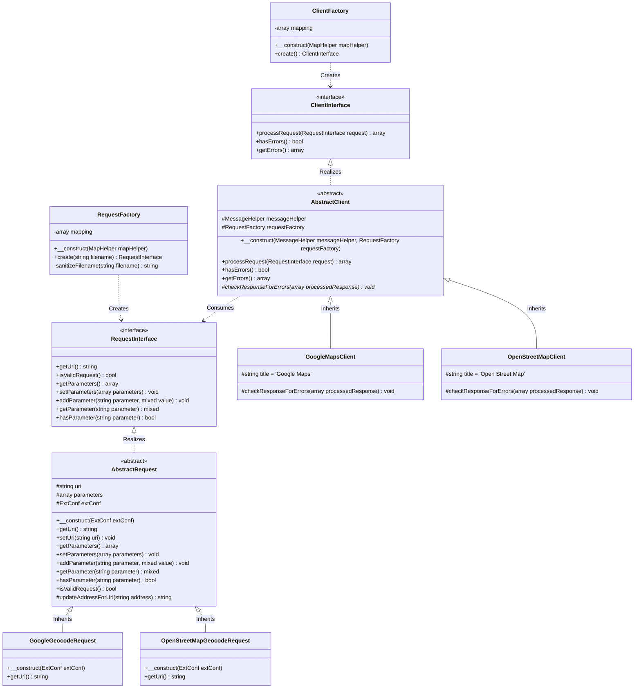

# Client & Geocoding Request Architecture Specification

This specification documents the streamline-designed client-request architecture used for retrieving geocoding addresses and interacting with map provider APIs (Google Maps and OpenStreetMap) in the `maps2` extension.

---

## 1. Architectural Overview

To support multiple map providers seamlessly while avoiding duplication and high coupling, `maps2` implements a clean abstraction layer based on **Factory**, **Interface**, and **Template Method** design patterns.

The key objectives of this design are:
1. **Streamlining APIs**: Providing a single, consistent interface to the rest of the extension regardless of whether Google Maps or OpenStreetMap is active.
2. **Provider Swapping**: Making provider selection dynamic and completely encapsulated away from the calling code.
3. **Decoupled Requests**: Encapsulating request-specific URI generation and parameters (such as geocoding) into separate request objects.

### Class & Interface Diagram

The relationships between the interfaces, factories, abstract classes, and concrete implementations are visualized below:

---

## 2. Component Specifications

### 2.1. Client Components

#### `JWeiland\Maps2\Client\ClientInterface`
Defines the contract for all Map clients. Ensures that any client implementation can process a request and report any occurring errors through a unified interface.
- **`processRequest(RequestInterface $request): array`**: Sends the request to the map provider and returns the parsed JSON response body as an associative array.
- **`hasErrors(): bool`**: Returns whether the client encountered any validation, connection, or response errors.
- **`getErrors(): array`**: Retrieves a list of occurred errors, formatted as flash messages.

#### `JWeiland\Maps2\Client\AbstractClient`
An abstract base class implementing `ClientInterface`. It encapsulates the shared request processing lifecycle:
1. **Request Validation**: Validates the request URI beforehand using `$request->isValidRequest()`.
2. **HTTP Execution**: Performs the actual network request using TYPO3's native `RequestFactory` wrapper.
3. **Response Parsing**: Translates the raw JSON body to a PHP array.
4. **Hook for Provider-Specific Validation**: Delegates error checking of the JSON content to the abstract `checkResponseForErrors()` method.
5. **Flow Guard**: Halts processing and returns an empty array `[]` if either the HTTP call failed, the response was invalid, or any validation/business logic error occurred.

#### `JWeiland\Maps2\Client\GoogleMapsClient`
Extends `AbstractClient`. Provides specific validation logic for Google Maps' API responses:
- Inspects the returned `status` key.
- Handles `'ZERO_RESULTS'` by translating and adding a user-friendly flash message.
- For other non-`'OK'` statuses, adds the returned `error_message` directly.

#### `JWeiland\Maps2\Client\OpenStreetMapClient`
Extends `AbstractClient`. Provides specific validation logic for OpenStreetMap/Nominatim's API responses:
- Checks if the parsed JSON response is empty `[]`, which represents "no results found" for Nominatim, and triggers the appropriate translated flash message.

#### `JWeiland\Maps2\Client\ClientFactory`
Constructs the concrete client instance depending on the extension's configured provider.
- Resolves the current map provider using `MapHelper->getMapProvider()`.
- Maps the provider to either `GoogleMapsClient::class` or `OpenStreetMapClient::class`.
- Instantiates via `GeneralUtility::makeInstance()` to ensure dependency injection container support.

---

### 2.2. Request Components

#### `JWeiland\Maps2\Client\Request\RequestInterface`
Defines the parameters and getters/setters for building an API request payload.
- **`getUri(): string`**: Computes and returns the complete, fully formed API URL (with parameters and API keys embedded) ready for the HTTP client.
- **`isValidRequest(): bool`**: Evaluates if the generated URI has a valid format and is not empty.

#### `JWeiland\Maps2\Client\Request\AbstractRequest`
An abstract base class implementing `RequestInterface` that holds parameters and performs common sanitation:
- **`updateAddressForUri(string $address): string`**: Sanitizes the query string. If the query is a numeric ZIP code and a default country is configured in `ExtConf`, it appends the country to prevent a broad, worldwide query. Finally, raw-URL-encodes the address string.

#### `JWeiland\Maps2\Client\Request\GoogleMaps\GeocodeRequest`
Calculates the geocoding URI for Google Maps.
- Appends the query parameter and embeds the API Key stored in `ExtConf`.

#### `JWeiland\Maps2\Client\Request\OpenStreetMap\GeocodeRequest`
Calculates the geocoding URI for OpenStreetMap/Nominatim.
- Formulates the request with the query address and specific Osm params.

#### `JWeiland\Maps2\Client\Request\RequestFactory`
Instantiates concrete request objects.
- Uses a clever sync-by-filename mechanism: if requesting a `GeocodeRequest`, it will automatically build `JWeiland\Maps2\Client\Request\GoogleMaps\GeocodeRequest` or `JWeiland\Maps2\Client\Request\OpenStreetMap\GeocodeRequest` depending on the active map provider.

---

## 3. Best Practices & Guidelines for Future Extensions

When extending the client-request subsystem (e.g., adding Mapbox or another provider):
1. **Implement `ClientInterface`**: Inherit from `AbstractClient` and define a custom `checkResponseForErrors()` to analyze the specific error formats of the new provider.
2. **Add Mapping Entry**: Register the new provider key and class string inside `ClientFactory::$mapping` and `RequestFactory::$mapping`.
3. **Align Request Directory Structure**: Create a matching directory under `Classes/Client/Request/[ProviderName]/` and implement the corresponding request types (like `GeocodeRequest.php`). Keep filenames in sync across directories so that `RequestFactory` can swap them seamlessly.
4. **Use Constructor Property Promotion**: Ensure dependencies (such as `MapHelper`, `ExtConf`, `MessageHelper`, and native `RequestFactory`) are properly injected using modern PHP 8.2 constructor injection rules defined in `AGENTS.md`.
