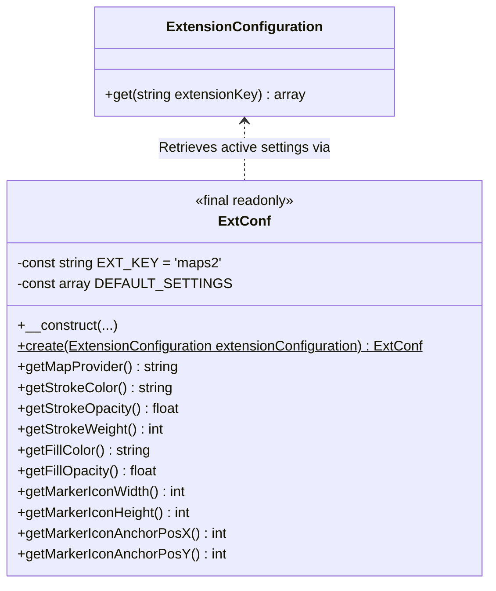

# Extension Configuration Architecture Specification

This specification documents how the `maps2` extension handles its global configuration subsystem under TYPO3 13.4+ / 14 LTS, including type casting, default values fallback, Dependency Injection integration, and robustness testing.

---

## 1. Architectural Overview

TYPO3 extensions traditionally define customizable administrative settings inside `ext_conf_template.txt`. In modern, composer-based TYPO3 installations, these settings are saved globally in `config/system/settings.php` under the extension key `'maps2'`.

To avoid accessing global state or arrays directly in the application code, `maps2` encapsulates all configuration data within a streamlined, type-safe **Value Object** called `ExtConf`. 

The core concepts of this architecture are:
1. **Immutable Configuration**: `ExtConf` is defined as a `final readonly` class, ensuring configuration values cannot be modified during runtime.
2. **Single-Source-Of-Truth Factory**: It leverages TYPO3's modern `ExtensionConfiguration` API to retrieve active settings, merging them safely over predefined defaults.
3. **Type-Safety & Sanitation**: Casts dynamic settings retrieved from the database/file system to their strict types (`int`, `float`, `bool`, `string`) and sanitizes credentials (using `trim()`).
4. **Dependency Injection & Singleton Lifecycle**: Integrated directly with Symfony DI so that it acts as a request-wide singleton, avoiding repeated array-merging and database reading overhead.



---

## 2. Component Specifications

### 2.1. `JWeiland\Maps2\Configuration\ExtConf`

#### Symfony Dependency Injection Registration
The class is annotated with `#[Autoconfigure(constructor: 'create')]`. This tells Symfony's Dependency Injection container to bypass the standard class constructor during auto-wiring and instead invoke the static factory method `create()`, injecting TYPO3's `ExtensionConfiguration` instance.

#### Class Properties and Constructor Property Promotion
Properties are organized into functional categories:
* **General Map Config**: `mapProvider`, `defaultMapProvider`, `defaultMapType`, `defaultCountry`, `defaultLatitude`, `defaultLongitude`, `defaultRadius`, `explicitAllowMapProviderRequests`, `explicitAllowMapProviderRequestsBySessionOnly`.
* **Google Maps API Config**: `googleMapsGeocodeUri`, `googleMapsJavaScriptApiKey`, `googleMapsGeocodeApiKey`, `googleMapsMapId`.
* **OpenStreetMap API Config**: `openStreetMapGeocodeUri`.
* **Polygon/Marker Styling & Design**: `strokeColor`, `strokeOpacity`, `strokeWeight`, `fillColor`, `fillOpacity`, `markerIconWidth`, `markerIconHeight`, `markerIconAnchorPosX`, `markerIconAnchorPosY`.

All parameters utilize **Constructor Property Promotion** (PHP 8.2+) with default values set to match their respective key in `DEFAULT_SETTINGS`.

#### Static Constructor & Merging Flow (`create()`)
```php
public static function create(ExtensionConfiguration $extensionConfiguration): self
```
1. Initializes localized `$extensionSettings` array with the class's default settings.
2. Calls `$extensionConfiguration->get(self::EXT_KEY)` inside a try-catch block to retrieve the configured settings from `config/system/settings.php`.
3. Merges active settings on top of default fallback values using `array_merge`.
4. Returns a new self-instance, explicitly casting each array value into its designated data type:
   * String properties are cast using `(string)`.
   * Numerical coordinate values (latitude, longitude) and stroke/fill opacities are cast using `(float)`.
   * Dimension properties (width, height, radius) are cast using `(int)`.
   * Settings toggles (allow requests, session constraints) are cast using `(bool)`.

---

## 3. Data Casting & Validation Robustness

TYPO3's Extension Manager backend can sometimes yield invalid or unexpected data types (such as numbers passed as string characters or empty values for credentials). To secure the extension against runtime crashes:
* **Getter Sanitization**: Method returns like `getGoogleMapsGeocodeApiKey()` and `getGoogleMapsJavaScriptApiKey()` apply PHP's native `trim()` to prevent trailing whitespace from invalidating geocoding API requests.
* **Fallback Type Casting**: Any mismatched values saved in TYPO3 configurations are strictly coerced back to correct types inside `create()`. For example, a boolean `true` for a number returns `1`, and a string like `'123Test'` is gracefully coerced to integer `123`.

---

## 4. Quality Assurance and Testing Specs

The configuration subsystem's casting logic is extensively covered in `Tests/Functional/Configuration/ExtConfTest.php`.

### Mocking of Extension Configuration
Tests utilize PHPUnit's `MockObject` capabilities to simulate the output of TYPO3's native configuration container:
```php
$this->extensionConfigurationMock
    ->expects($this->once())
    ->method('get')
    ->with('maps2')
    ->willReturn([
        'defaultRadius' => '123Test',
    ]);
```

### Key Test Case Scenarios Covered:
1. **Initial Baseline Fallbacks**: Verifies that when no settings exist, calling a getter (e.g., `getMapProvider()`) returns the predefined `DEFAULT_SETTINGS` default value.
2. **Explicit Setter Checks**: Confirms custom values configured by the administrator are successfully returned by their corresponding getter.
3. **Invalid Parameter Tolerances**:
   * **Strings to Integers**: Tests like `setDefaultRadiusWithStringResultsInInteger` and `setStrokeWeightWithStringResultsInInteger` confirm that string formats are correctly parsed and returned as strict integers.
   * **Booleans to Integers**: Tests like `setDefaultRadiusWithBooleanResultsInInteger` and `setMarkerIconHeightWithBooleanResultsInInteger` check that boolean configurations parse gracefully into `0` or `1` integer configurations.
   * **Strings to Booleans**: Tests like `setExplicitAllowMapProviderRequestsWithStringReturnsTrue` confirm that generic text values evaluate properly to strict boolean `true` or `false`.
