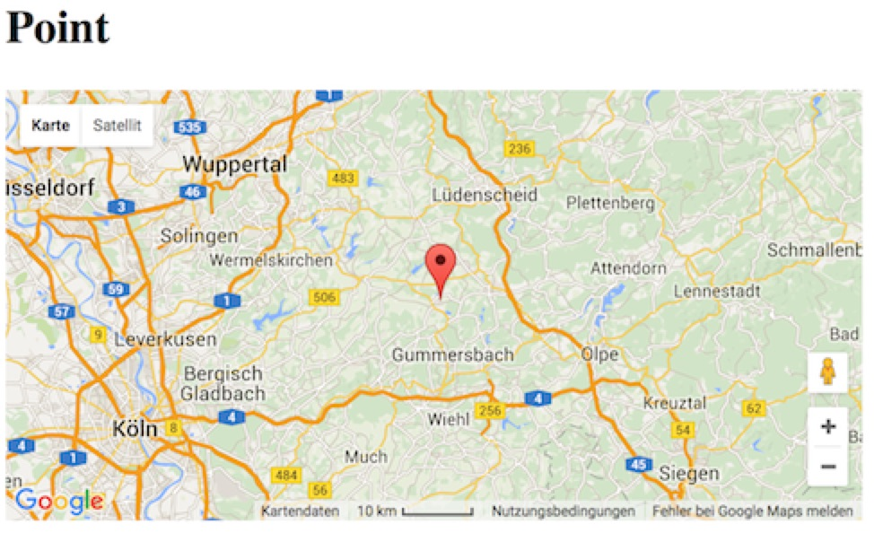
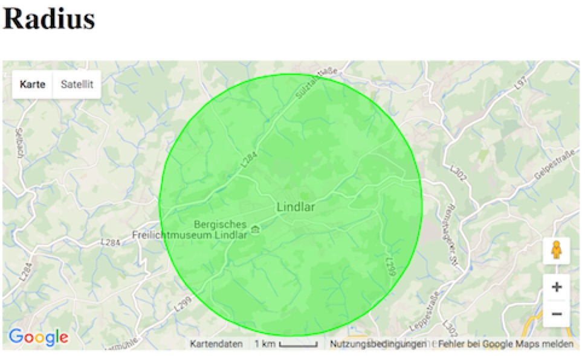
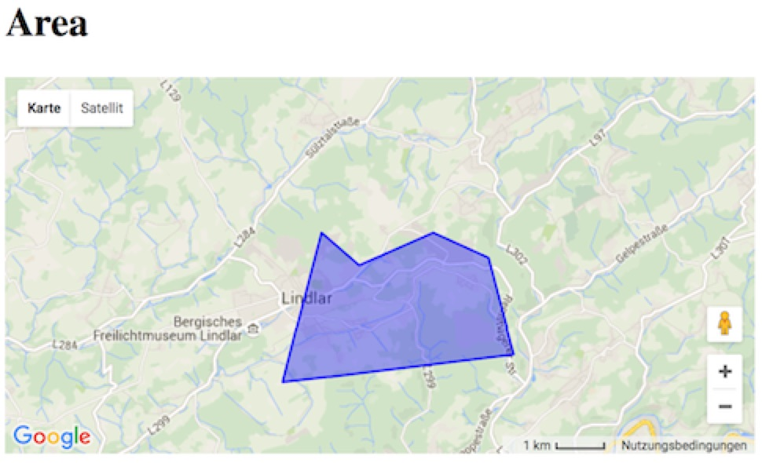
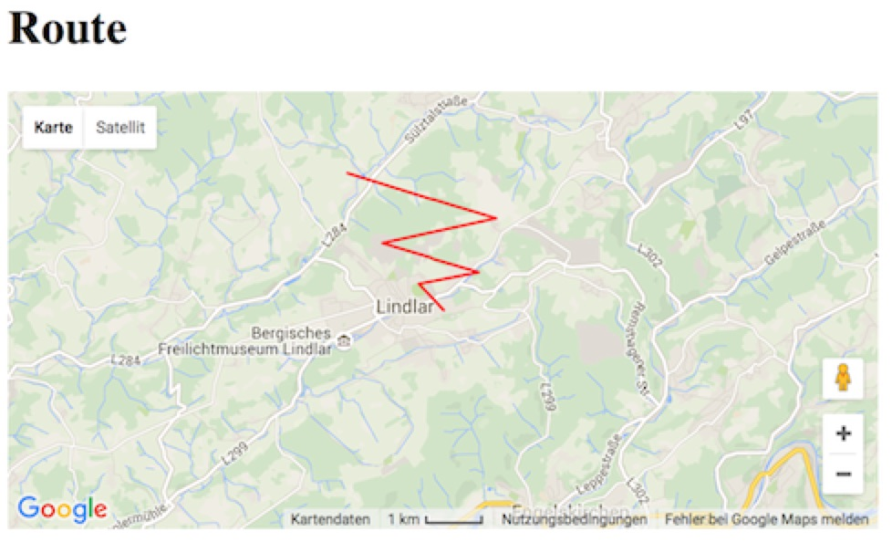
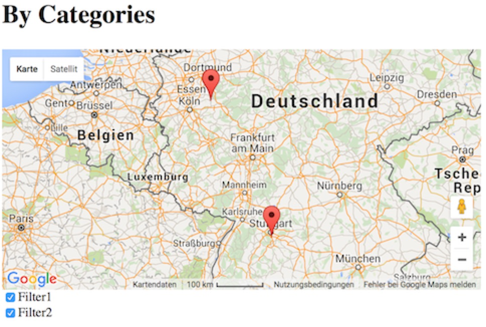

.. include:: ../Includes.txt

.. _introduction:

Introduction
============

.. _what-it-does:

What does it do?
----------------

maps2 is an extension for TYPO3 CMS. It can render you a map based on Google Maps and/or OpenStreetMap. If you
want, you can create Markers, Routes, Area and Radius overlays. Assign these overlays to categories to
build a map, with all points based on selected category.

.. _screenshots:

Screenshots
-----------

See maps2 in action.

Point
~~~~~

         Introduction Package just after installation (caption of the image)

         How the Frontend of the Introduction Package looks like just after installation (legend of the image)

Radius
~~~~~~

         Introduction Package just after installation (caption of the image)

         How the Frontend of the Introduction Package looks like just after installation (legend of the image)

Area
~~~~

         Introduction Package just after installation (caption of the image)

         How the Frontend of the Introduction Package looks like just after installation (legend of the image)

Route
~~~~~

         Introduction Package just after installation (caption of the image)

         How the Frontend of the Introduction Package looks like just after installation (legend of the image)

Multiple
~~~~~~~~

         Introduction Package just after installation (caption of the image)

         How the Frontend of the Introduction Package looks like just after installation (legend of the image)
